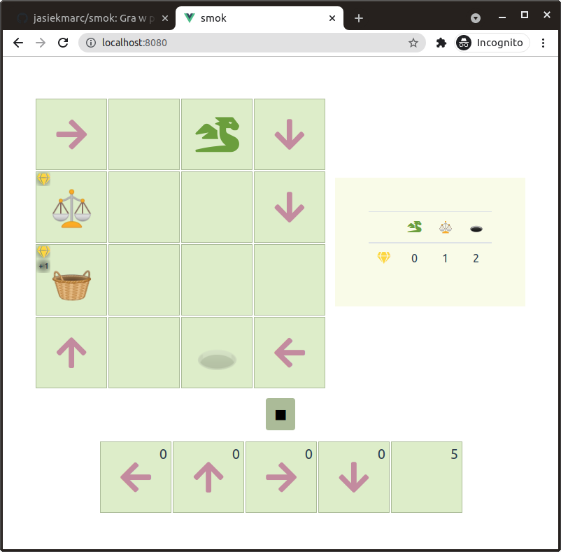

# Smok: Gra w programowanie.

Smok (The Dragon) is a small computer-based riddle game aimed at children. By
putting objects on the board we are guiding the Dragon towards the cave.

From mathematical standpoint, the Dragon is a Turing machine with counters
operating on a two-dimensional tape.

The original game was designed and implemented in Flash by Bartosz Dolecki for
[Wrocławski Portal Informatyczy](https://informatyka.wroc.pl/) (a local
educational website). This repository contains a quick implementation of some
basic principles of that game in Vue. Meanwhile a full reimplementation is being worked on with use of React.



## Project setup
```
npm install
```

### Compiles and hot-reloads for development
```
npm run serve
```

### Compiles and minifies for production
```
npm run build
```

### Lints and fixes files
```
npm run lint
```

### Customize configuration
See [Configuration Reference](https://cli.vuejs.org/config/).
